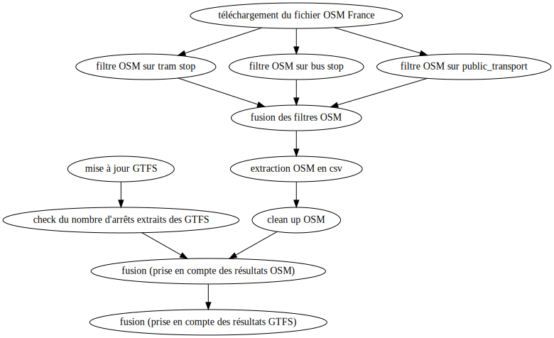

# Extraction des points d'arrêts transport en France

## Installation
Les scripts d'extraction sont en python et en bash, orchestrés par [factotum](https://github.com/snowplow/factotum).

Pour les extractions d'OpenStreetMap, les applicatifs suivants sont nécessaires :
* osmosis
* osmconvert

## Processus d'extraction

(généré avec /factotum dot bato_update.factfile --output factotum.dot && dot -Tsvg factotum.dot -o factotum.svg)
