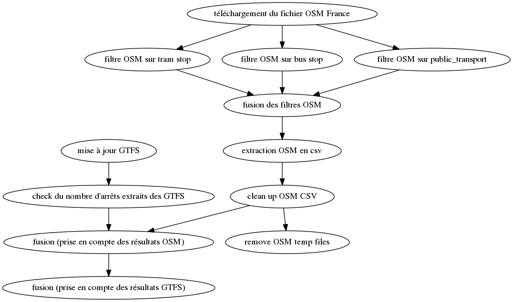

# Extraction des points d'arrêts transport en France

## Installation
Les scripts d'extraction sont en python et en bash, orchestrés par [factotum](https://github.com/snowplow/factotum).

Pour les extractions d'OpenStreetMap, les applicatifs suivants sont nécessaires :
* osmosis
* osmconvert

## Processus d'extraction
Si besoin, mettre à jour la liste des sources GTFS en utilisant la commande :
`python3 get_Navitiaio_GTFS_List.py`

Ensuite, lancer la commande `factotum run bato_update.factfile`

(généré avec `factotum dot bato_update.factfile --output factotum.dot && dot -Tpng factotum.dot -o ./factorum/factotum.png`)
